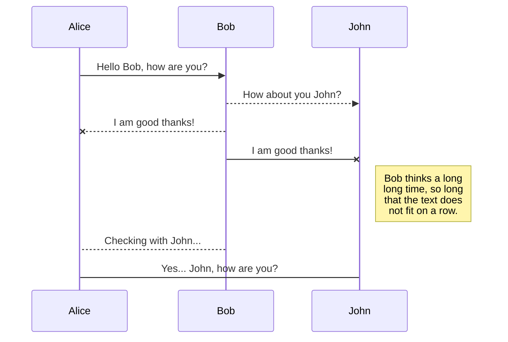
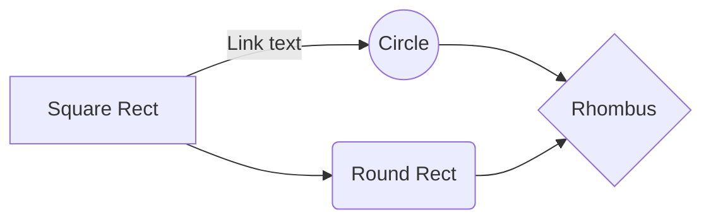

# BIENVENIDO AL REPOSITORIO DE JAKARTA EE V9!

Esté es el primer repositorio realizado por mi para Java EE, o mejor conocido como Jakarta. En esté repositorio estoy aprendiendo desde lo básico hasta lo avanzando en Java, Spring, Swing, Node.Js, Servidores y mucho más.

![](data:image/png;base64,iVBORw0KGgoAAAANSUhEUgAAAZoAAAB7CAMAAAB6t7bCAAAA7VBMVEX////9uUD5ggD+syIbIIv9tjT9uD39tS/+6c79tzj+2KH9uDr9ukL//Pf/+Oz/9eT9vk3+4LT+4K79wlr/8t3+3Kz9x3H+rwD+z4f9tCkAAIP5fgATGYn/7tT//vr9v1P+5sD+1JD+15r9xWcFD4f5jBn+9uj9ynb/6sn9w2H+5Lv29vv6miP9ryr9t0r+zoHKy+JRVKLj4/D7plgwNJRucK+nqc3+qgD6nSz5hxL7qTn6kyv7nin8qj78qi76mS5eYq2UlcGgospFSZ63uNYhJo6Jir79yJV9f7nCw9tBRJve3u1maa3Q0eXs7fXwlFG9AAAOzUlEQVR4nO2dfX/aOBLHMY5tjDGPTsAkPAQSIHT3aHttb7u7d9eHNLfd3eb9v5xDI1vWw1iG3Rj30+r3V2ubwehrjUajsVKrGRkZGRkZGRmdSr1p1XdghKvvdKq+BSNUW8drVH0PRpg2gessqr4JI0QTy7WCi6rvwkhV1HItyx2YOOCr02oWWHu1TBzwtak98AkZy5lUfSdGoqZLSsZyelXfipGotUPJWP511bdiJGiXkjEh2lemay8lsw/Rqr4ZI07NjIzldsOqb+f71UiOwXqxxclEz5Wp/6+teGBj82SswETPFWk+HIppsolIxjIJzoo0GdpDITzuxJaEZpv3WaMyFQ1t2+bD41XgSmicZmV39z1rRcjYs+xAuxtIZMycsxK1Y0LGtlhyObzzZTKWv6vyFr9ThV0gY8fpzGV6oZKxgnWlN/ldajoYUjTDFE2WnuHRLCu9y+9SFwkZhuYaI2O5d9Xe5neoXUrGHrbhwAIlY5JoJ9c1I2MPV+RAHydjubMiU0ZPqmZGxh6SLNkWiQAMmgrU48jYwwjqmgyar0Eb2xbRTNw8MgbNSTWxJTSdVi4Zg+aUimIJzXampGcMmiq0ckQy9o86MgbN6dRuSWS8239oyJh5zcnE0jOp4ttLPRqTDTiRlhIZ+4fLy/wYwDI5tJNpLZP56bJe16MxmeeTaCeT+XlP5q2OjFmvOY2uMTL125YWjVnlPIGaMpn/EDL1X7RoTG3ACbSVyfwIZC71aLx51ff97WuikHlbBzT/1fcaU4dWtqIcMvXLX7VogqjqO//WtZLA2N7tZYLm3zoyrql5LlltL49MvSAZMDNvCpSqsCunZ35JyRShMXmaUjW9k8n8wMgUzThNMqBUKekZjkzRtMZst1GmRjKZXzkyBbGzt6n67r9lKemZX+ucTOxcndT0TF1Ao48Cuu2q7//bVU9Ppn6pI2NWa0rUXEkCiGRM3rkqSXVNWXrm0ChgXvUv+FYl1zXZ3q3UaS5/1kcBJk1TjjTpmQOjALMdWjkKg0IyZvW5Ek2VxJlKpmioMW+mlyJd4swMNVXqAqtrUtBohxozqylFSl0TRqZgVmNym2UIr2tSOs1P+qHGJNCeXjl1Tcf5M3dgVjifXEpdE06m/tb4sxNLrWtCwRT5Myffn4Wbxl4r+fCUHFY3UFuRixtSFwzhYCNCjqrf22mImkRZRnzSyFMkfp59ZLVpbDZhf3+jjR67q2mOkc00+wmqjtwtLreu6dj4LD8VENme59nn8uE5ORwrH+vB1VJB2y4m18r4t/tL45biSJvEAicn6C7n9KpwFnu47BH7/MX+GpvNn6N+d92PnLvadBawxyu0cSt0W4U+fjY+LobtSGCwJMBB8Vk//zsism2ao6BZk/fb1JRoj+xJ4IkPWB82+HTkRdQlbqGp7GrgBt4ALIZ3eW86ZGnzFWzCz609XfRrnUEQTQYzdizM2Tghpmjws8dt6NuWXwj0fskhUzDftDSraDiaEJpbfe0DQdOALfE8mX4bLKj5IRUN+SKfJCsOQUMb1pkzewTNcre47p8SjVLXlEumXtcv1ejyZzia5P49mamKpm2R9nSU1aC0BWQLFI0bMAEOlzR2OPCFg9lVHjNP6XHtSNDcNVrLqCujcWUJaOST/hFotHVNUqcpyJ/pRjgczR19X1fxhAqa6YBc6d8po9KMtq7SmwCNu7xgmnnkSrfVroUjdnDgilel9xfR+3JbbGBZntc6s3CwaFvZWAON3+rKCjg0ysnuEbVgcl1TPpm9P9ORcdV244SiSfftVPI7CpqRk7QrZhazAGhiLiJsb2Zk6xZnxF91Ll+VKN0ZKXtmNlEtnNcm7XCe7dNHLgp2bUVwFtD485yzh0hb13RUEOBp/84DioY+2qR1pKyojOacDjRqjLzwEwu+ZIGiEQ6G0PNcHsS5ehWoS4IAt6AUFdD4o5yzFM3f2Fh5oa1rOiYIKKh1xtBMiTcKlq46V5XQNLw89kGeBQRNbRLIVnLQNBzye+DuNJmnQ9D89RdalPTMz/lkCjIBnhIYC8LQTGLipCKPtIPoDEU0EMkiIcDeAvnsYOOry6sYmhoZWoS2zEGz88nLdde+Pr9RKpqiuqZjOo066xOEoSG/3V/UyLMciz1fQEP3XvUx3zKiFoj/kYIQFA1pciFSx9GExEV6HeCu2TqkTDSFdU3HdBrNdJMIQRO2aIsCIbFLCGhoCGBh6ImjiyNKSGwjFM3oMDRzB4KakHg0zR+xKhFNYV3TMZ2mW1CugaCZk6fSSjy72Ol4NDQEQNNzW2Khm1gQy0ZRNBfBQWhIgoF4MoQ4r/LQKOmZWEemqNMU1QQgaNbUG9GxXEy1cGg2Xr590tTEAjzfYh08hga6qc+PHiiatk/7IkQfGkddGpq2WnGWHzYXdprCLYNUNNAC4C/g6RSmYhma/BCA/AQrGaUUT4WigWMCQRRN30kmaSEZw7hkjaQnQfPyGWJXJpOfniHSz2nswtVNFQ20QIv8qwG/gvdHDA3NAuRML0QL3NS9hqIhDlT6y0comhmLxYF4bqr4aeY19+/ePxfwhK38FwJRaRMB+EMtSEWzDJh3IT1DSNYwNMkm3y5aqDNg/ol6NH7GomQDOiPqGYUNJzA0URJb1BJnGuTN3ymaXShO9tMxl6LZiGdR5/hhPP74/vkj+/7r7nDI0dGkZ8Cdad9Ec4Pikk0FTcezWPyjPJ0pmvQvfaFJwQ7zZ4kFvm/RRMNskKrlwA67gTgxxtAsslkS9Wh5sSfNobm+oDh9PmgOLRBOOmqmiejx9Xg8vuLwhHMOj55MwV5O8QEvoiloFg6NrojAozlcC1E00YYl1pVlmrQNW4kFeL45t5pknjMlD5HoeTE0AZdbIMRzpzboooAnopGe4byXj+5vbs6ubsZnHx94PDOCR5M4g06jXXc+qJhWRhOCN0oc4bQlpVoAjdPrQggAo01XsTjtcvFWOJMsoOs1viv5fgTNJPNniUfLW1ZH0Th/CU3t8cX4bK89nk97PC/Tb5hf3729vNTB0cYAbuuQCnQZDbQAGyXh6eTKcXo03w5k+msI5ZRNiaCjxIIF7vlG0ATxWm4ZBM2Iz/pQj5aTrEHXa6ReI54M8l/Ze/YAbBQ803Dzv3/eXuby0QbO2mUaJhkNtADrCg0p09zLPFm/FtEVR3kIBQsBsyCgTtE4SWEAtNKF+vQjaKCfMBgjzmnKomi6A0GzdALWlwY70FKzJHA/vjo74/C8+O2zjOdId3ZAdEYkoWl3XT47A08nF4cyNNBZRpBDk9wmJLo4CzPRQpO6RCiemWwhbEYicBXNnPdniUfLefjS4DkUJEVoU/Gsrom+fMrYUDxnHJ42hudWA8byD6wQkdDMpYecdiL2TKVoaKi7gjXHWHzot1KjUQvst4vzGlhNRTIKKhqSYOAm0DSBgM9dnny95uWrmzNRezxXGZ5auyHh0U1pDn7hWUJDKmn2n2Wak46RJWsSNF7iWGDRMRAzDlCLE2TThjl0E2ZBRLOJLXXloYaggQSDf52Z3QFU9Cc9faLm8XeZDcNzn6YNODzaDI178HeLaGj6pTVLF8xnXWItS7VQNKyKAvyd+NRDmoe3MBMtSNkAKAJQ1+IUNMmKvnRj+AuqJeTQnr1A2FA8NxyeFcWjdWdqYVmeICJjl6vlJvBflmrpSb+6B4MFvy6AW7DctBNLaDZqkoZIQZPUQUlW8QqlMtKbzz7ibCie8cff3nB4doPA8XNmnEfUOMPgwoL+Jb7zPZt4y7UBU3jqua+b5llIv0HOodF+J0/sZTTK339NFGPjdymZZw2bBM/vGZ5ptN3NUDzOES9uLvjBJMr5mwQsWaNU1Gxo3QZrxMjDLbARXEazRbuNjAadqPLPDK9yFgWeYeNNER5XwuNrSpxlQYUGC7JgWHdbgiib5AK1RBB6SbZygFmAm0sra5TMM80sSBNXGU3Xxc2iqe+S1mseX13p2SR4Xu3xpJ+Jtutu4LC/9uTfFb1M085+8zktWKb/AffkdqMOpxXNzSQuS0VDC87SbB2kedxWB7GQNL6CZkthigGlhGYC8dloJdiFUBApiCptKe3lAWwSPJ9ev/mDtVBv3aJ4/EFR2DxpddMf1KOVyUnENaHZdPFqmISm8S1S87yDirPkPE3zSK0Cc5B06q6u17jScEUkobn2la9NR0lk8+rS6tD++HQQmwTPmYTH92ZFZBax6zqLiLxas6MjQ7p8Aq3syQ/Ujq16omjadLShMR7kB5Rdi0ecBRVNkqUXSjVFNCEkUl3J6hS6m5peLbFE8PnNgWj2cAid8fjdhy/ph6NeAZn2DFrCj70g9ugfI0yf2JD2D9kdbriegL3EQYtdYWGL9jAltUUt0K6JrHIiBe0iGpqiUKJOeGZitZGTmmdFDlfzrJ49qOb5zbgQCRAZf/r458OH+/s3b94/vH74/FhsuUZS9nIU5qRD6RzzRkkWLImhMDQ16hRHzIKSvKMzUzqgIWhoYwkVuCKaNc5gg39bqW8KPOjYXI0hRrv/otYVHKTQEv9wp8eSbRcB0u611B/NyT9RNHTAIk0HFhBnQccKCBWwmmcYbYQxTkDTpvNa9afQ7qqEo6W+X5OTFoDe8uLD88OM5Gm6jrOO48fsqevAw4RsMwRjO711FA0NbYO72griWWTxESIsaiG3okboNgKaPh/h8boWE3ypSkWDhtBkreDh82EG9GosY8cP3MB34nWWNj6PHceJkaWEcObtz8A6dI9cY8toNuSoY2/7YAHJRIRdcgH89fAmWBCT1aFLTntc45xzV03vPPUj9Htt8jFlkAjhdlTZFA1+1jv0Xc4viku7Gb96/6X4gwdqdX69vlvuzoUXJ5p7LdR3WvZDCJwhbTPBr2mCzsFCU2+hAf9qI6ebzewof1W4gJPYz4AzC7mfT5u4FjBcTnLOal914SWFAjfj13/TjRk9mV7f8GB+e1n8CaMTKRtuDJivTclwczX+84/ii41Oqg+Ezfj3J4nJjJ5W726uxg9/cWJpVKoerz6ZsOwr1Wcz/BsZGRkZGRkZGRkZGRkZfSv6PxTjZpWTBlsZAAAAAElFTkSuQmCC)

    public static void main(String[] args) {  
	    System.out.println("Hola Mundo");
    }

# Files

StackEdit stores your files in your browser, which means all your files are automatically saved locally and are accessible **offline!**

## Create files and folders

The file explorer is accessible using the button in left corner of the navigation bar. You can create a new file by clicking the **New file** button in the file explorer. You can also create folders by clicking the **New folder** button.

## Switch to another file

All your files and folders are presented as a tree in the file explorer. You can switch from one to another by clicking a file in the tree.

## SmartyPants

SmartyPants converts ASCII punctuation characters into "smart" typographic punctuation HTML entities. For example:

|                |ASCII                          |HTML                         |
|----------------|-------------------------------|-----------------------------|
|Single backticks|`'Isn't this fun?'`            |'Isn't this fun?'            |
|Quotes          |`"Isn't this fun?"`            |"Isn't this fun?"            |
|Dashes          |`-- is en-dash, --- is em-dash`|-- is en-dash, --- is em-dash|

## KaTeX

You can render LaTeX mathematical expressions using [KaTeX](https://khan.github.io/KaTeX/):

The *Gamma function* satisfying $\Gamma(n) = (n-1)!\quad\forall n\in\mathbb N$ is via the Euler integral

$$
\Gamma(z) = \int_0^\infty t^{z-1}e^{-t}dt\,.
$$

> You can find more information about **LaTeX** mathematical expressions [here](http://meta.math.stackexchange.com/questions/5020/mathjax-basic-tutorial-and-quick-reference).

## UML diagrams

You can render UML diagrams using [Mermaid](https://mermaidjs.github.io/). For example, this will produce a sequence diagram:

And this will produce a flow chart:

